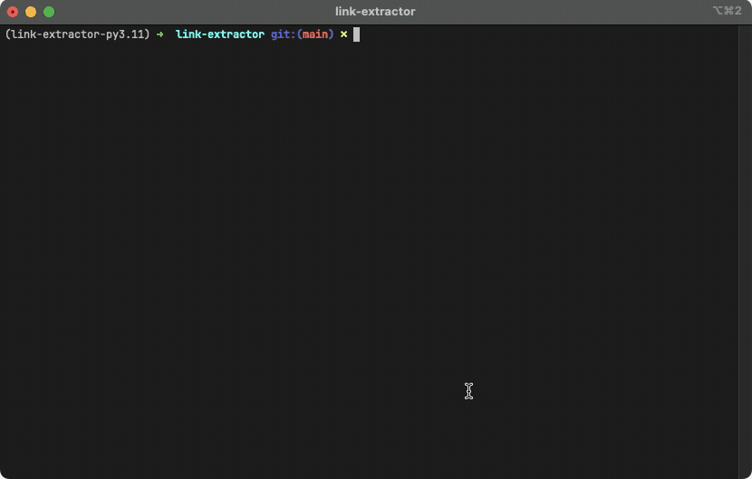

<div align="center">

# sre-devops-case-study

This project showcases the technical assignment for a company named *[REDACTED]*.

</div>


## Demonstration

Find below some illustrative animations of the application in action.

### Running as native Python application

Find below an illustrative animation of the tool running as a native Python application.

<div align="center">


</div>

### Running as Docker Container

Find below an illustrative animation of the tool running as a Docker container.

<div align="center">



</div>

### Running as Kubernetes Helm Chart

Find below an illustrative animation of the tool running the Docker container as a Helm Chart deployed instance.

<div align="center">


</div>

---

## 📂 Repository Layout

An overview of the repository structure, including descriptions for each key path:

```plaintext
.
├── Binaries
│   └── LinkExtractor
│       └── Release
├── Helm
│   ├── Charts
│   │   └── link-extractor-app-pod
│   └── Values
│       ├── DotNet
│       ├── Falco
│       ├── Python
│       └── Trivy
├── Scripts
│   ├── Bash
│   │   ├── Charts
│   │   ├── Docker
│   │   ├── DotNet
│   │   ├── Part4
│   │   └── Python
│   └── PowerShell
├── Services
│   └── GitLab
│       ├── config
│       ├── data
│       └── logs
└── Solutions
    ├── DotNet
    │   └── LinkExtractor
    └── Python
        └── link-extractor
```

### 📁 **Binaries**

- Contains the compiled binaries for the `.NET` version of the `LinkExtractor`.

### 📁 **Helm**

- Holds Helm charts and configuration values for deploying components in a single-node Kubernetes cluster (e.g., Docker Desktop).

### 📁 **Scripts**

- Contains helper scripts for a range of tasks:
  - **`Bash`**
    - Automates operations such as:
      - **Charts**: Scripts for linting, packaging, and deploying Helm charts.
      - **Docker**: Scripts for building and pushing container images.
      - **DotNet**: Scripts for testing, building, and packaging `.NET` applications.
      - **Part4**: Scripts fulfilling the "Part 4" case study requirements.
      - **Python**: Scripts for linting, testing, formatting, and versioning Python projects.
    - General scripts, such as `service_*.sh`, for managing `docker-compose` projects (e.g., GitLab services in the `Services` folder).
  - **`PowerShell`**
    - PowerShell alternatives to Bash scripts where applicable.

### 📁 **Services**

- Includes `docker-compose` projects for deploying services, such as GitLab, needed for demonstration purposes.

### 📁 **Solutions**

- Contains source code for the **LinkExtractor** application:
  - **DotNet**: `.NET` version of the application.
  - **Python**: Python version of the application.

---

## 🛠️ Project Overview

The project solution is divided into the following components:

1. **Application**: The main functionality.
2. **Container**: A containerized version of the application.
3. **Deployment**: Kubernetes deployment using Helm.
4. **Pipelines**: CI/CD pipelines for automation.

---

### The Application

The **application** is a Python-based project located at:

```plaintext
Solutions/Python/link-extractor
```

#### Tools & Technologies

- **Poetry**: For project and dependency management.
- **Pipx**: Installs tools in isolated environments, avoiding global system pollution.
- **Virtualenv**: Creates isolated environments for package installations.
- **Pyenv**: Manages multiple Python versions on the same system.

#### Key Features

- Developed using the `click` framework for CLI management and validation.
- Implements parallel link processing for efficient scraping.
- Utilizes `aiohttp` for asynchronous HTTP requests with `asyncio.gather`.
- Structured using `poetry`, adhering to PEP standards with `pyproject.toml`.
- Unit tests are scaffolded using `unittest`.

---

### The Container Image

The **container image** is based on the official Python 3.11 base image.

#### Key Features

- **Multi-stage builds** for improved caching and performance.
- Parameterized Dockerfile supporting `UID` and `Version Number`.
- Application packaging occurs in the `build` stage, reducing final image size by excluding development dependencies (e.g., `poetry`).
- Includes a `HEALTHCHECK` to monitor the container's status.

---

### The Deployment

The **deployment** leverages Kubernetes and tools like `helm` and `helmfile` to manage resources.

#### Tools

- **Helm**: Defines and packages Kubernetes resources into reusable, templated charts.
- **Helmfile**: Ensures Helm charts are properly registered and downloaded, supporting additional tools like `trivy` and `falco`.

#### Key Features

- The Helm chart deploys a single `Pod` with a `restartPolicy` of `Never`, per assignment requirements.

---

### The Pipelines

The **pipelines** are implemented using GitHub Actions workflows (located in `.github`), automating the following tasks:

#### Python Pipeline

1. Install Poetry.
2. Lint and Test.
3. Bump Version (manual trigger only).
4. Build.
5. Upload Artifact.
6. Publish Release.

#### Docker Pipeline

1. Build Multi-platform Images.
2. Push to Docker Hub.

#### Helm Pipeline

1. Lint Charts.
2. Bump Chart Version.

---

### ✨ Highlights

- **Scalable Design**: Efficient use of Python's async capabilities for parallel processing.
- **Streamlined CI/CD**: Pipelines automate the entire lifecycle, from linting to publishing.
- **Security Integration**: Uses `trivy` and `falco` for security scanning.

---

### Design Considerations

#### Application

The **application**, as specified by the test requirements, states that it must run to completion and terminate in a halted state. As in to say, once the application runs to completion and provides an exit-code, nothing further should happen to the Kubernetes resources used for deploying the **application**.

However, there are some deficiencies with this **application** that I am aware of, including the inability to perform "rolling updates", or "blue/green" and "canary" deployments. The reason for this is because there is no incoming traffic for this particular application.
